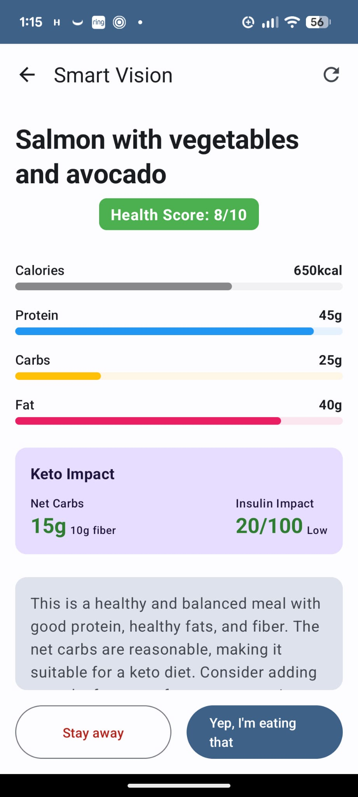

# Healthio

**Healthio** is a minimalist, privacy-focused Android health dashboard designed for intermittent fasting, calorie tracking, and workout logging. It emphasizes a "Snap & Go" interaction model with AI-powered food analysis and seamless integration with Google Sheets for data sovereignty.

  

## Key Features

*   **Flux Timer:** A visual, intuitive timer for Intermittent Fasting (16:8 default) with clear "Fasting" and "Eating" states.
*   **Smart Vision (AI Nutritionist):** Snap a photo of your meal, and Healthio (powered by Gemini AI) analyzes it to estimate calories, macros, and provide a health score with feedback. Simply take a picture, and it is automatically sent to Gemini for instant analysis and logging into your dashboard.

  

*   **Energy Dashboard:** Track your daily Calorie Intake vs. Burned Calories in a simple, unified view.
*   **Smart Reminders:** Intelligent notifications remind you to log meals (Breakfast, Lunch, Dinner) or workouts only if you haven't already.
*   **Privacy-First Sync:** Securely sync your data to a Google Sheet in your personal Drive. Using the restricted `drive.file` scope, Healthio only interacts with its own files, keeping the rest of your Drive completely private.
*   **Health Connect Integration:** Seamlessly import workouts, total daily active calories, and **Weight** data from wearables and smart scales (like Withings) via Google Health Connect.
*   **Weight Tracking:** Monitor your weight trends with a clean time-series chart. Log weight manually or sync automatically from smart devices. Supports both **kg** and **lbs** units.
*   **Workout Logging:** Log workouts manually or sync to keep track of your active energy burn.
*   **16 KB Device Support:** Fully optimized for next-generation Android devices with 16 KB page size support.
*   **Modernized UI:** High-performance, edge-to-edge interface with Material 3 components and optimized system-wide themes.
*   **Historical Stats:** Visualize your progress with beautiful charts for Fasting consistency, Workout frequency, Nutrition trends, and Weight history over the Week, Month, and Year.

## Tech Stack

*   **Language:** Kotlin
*   **UI:** Jetpack Compose (Material 3)
*   **Architecture:** MVVM
*   **AI:** Google gemini-2.5-flash-lite (via Generative AI SDK)
*   **Local Data:** Room Database
*   **Sync:** Google Sheets API (v4) & Google Sign-In
*   **Scheduling:** WorkManager
*   **Charts:** Vico

## Getting Started

1.  Clone the repository.
2.  Add your Gemini API Key in the settings (or code configuration).
3.  Build and run on an Android device (Android 13+ recommended for notifications).

## Privacy

Healthio is built on the principle of least privilege. 

*   **Restricted Data Access:** The app uses the `https://www.googleapis.com/auth/drive.file` scope, meaning it can **only** access files it creates or that you explicitly open with it. It has zero visibility into your other personal Google Drive documents.
*   **Data Sovereignty:** Your data stays in your personal Google Drive account in raw spreadsheet format. You own it, and you can export or delete it at any time.
*   **Local-First:** All health data is stored locally in a Room database before being synced, ensuring the app remains functional even offline.

---
*Built with ❤️ for a healthier lifestyle.*
